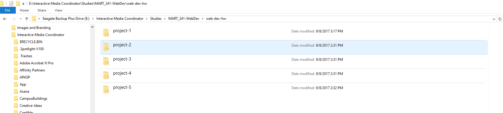

# My First README.md
# THIS IS A LEVEL 1 HEADER
## Mark Lannen
### THIS IS A LEVEL 3 HEADER

This is a paragraph. This paragraph requires no extra markup to signify it as such.

An empty line between text blocks signifies a new paragraph.

To mark certain words as bold we surround them with two **asterisks**. To mark certain words as emphasized or italic we surround them with a single *asterisk*.

Link text is placed between square brackets, and the associated URL link follows between parenthesis. [This is a link to the Guardian's site.](https://www.theguardian.com/uk)

We can identify code in a paragraph using the backquote character the backquote is the leftmost key on number line, below the esc key on most American keyboards. `var Der = 20`.

Lists are simply line items prepended with dashes to create an unordered list or numbers to create an ordered list.

- list item 1
- list item 2

___

1. List item 1
2. List item 2
